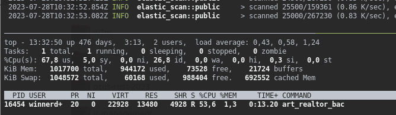

# Export from Elastic

## Что есть?

Есть сервер [ElasticSearch](https://www.elastic.co/) с индексами, каждый из которых соответствует одному разделу Базы по недвижимости

## Что надо?

Надо наладить регулярное формирование файлов с данными из Elastic'а
- Два файла в формате .json, по одному на каждый индекс: "жилая" и "загородная"
- Два файла в формате .csv по индексу "жилая". Почему два файла? Потому что один из файлов содержит объявления о продаже недвижимости, а второй - историю публикаций этих объявлений (каждомy объявлению из первого файла соответвтвует одна или несколько записей в истории публикаций, связь устанавливается по полю "guid" - идентификатор объявления)

Доступ пользователю к формируем файлам предоставляется через web-сервер nginx.

## Ограничения

Процесс формирования файлов будет происходит по cron'у на специально выделенном сервере, работающем под Ubuntu 20, с ограниченными ресурсами (1 CPU, 2GB RAM, HDD). С учётом других работающих на сервере процессах доступно для использования (свободно) не более 100MB RAM. Сервер снабжен только HDD ~75-100 IOPS.

## Архитектура

Для достижения консистентности при сканироания Elastic'а уместно использовать [Scroll API](https://www.elastic.co/guide/en/elasticsearch/reference/current/scroll-api.html), "постранично" сканируя Elastic

Оцениваемое количество записей:  
- от 100 до 300 тысяч объявлений в одном файле, 
- и до 2 млн записей в файле истории публикаций.

Размер одного (каждого) формируемого файла оценивается в сотни мегабайт (от 500MB до 1GB), значит, с учетом ограничений, от варианта "*накопить результат сканирования Elastic'а в памяти процесса, а затем все сразу сериализовать в JSON и записать в файл*" придется отказаться. Будем каждую "страницу" ответа, полученную от Elastic'а, сразу записывать в файл результата, не накпливая в памяти. Таким образом, нам в RAM достаточно будет места для размещения одной страницы ответа (на один индекс), что при размере страницы в 1000 объявлений, и при полном размере выборки в сотни тысяч объявлений позволит сократить потребность в RAM на два порядка (не менее, чем в 100 раз)

С учетом того, что последовательность действий выглядить как:
- запрос очередной страницы выборки у Elastic'а
- добавление результатов в файл
- запрос следующей страницы выборки у Elastic'а

то, принимая во внимание тот факт, что запись данных происходит на HDD (~75-100 IOPS), добавление результатов в файл может источником увеличения времени сканирования Elastic'а.

Поскольку мы используем Scroll API, требующий от Elastic'а сохранения состояния всей выборки в целом до окончания процесса сканирования (Elastic как бы "замораживает" состояние всех записей выборки на момент начала сканирования до его окончания), то в интересах снижения нагрузки на Elastic полезно уменьшить время сканирования.

Поэтому уделим немного дополнительного внимания процессу записи данных в файл. 

Чтобы уменьшить объем записываемых данных, будем их сжимать "на лету", пользуясь GzEncoder из crate'а [flate2](https://crates.io/crates/flate2). При этом запись в файл данных, полученных в результате предыдущего запроса к Elastic'у, будет происходить параллельно с выполнением следующего запроса к Elastic'у. Таким образом, запросы к Elastic'у будут происходить непрерывно друг за другом, без перерывов, минимизируя время сканирования. А параллельно с ними будет происходит добавление в файл полученных данных.

Здесь важно, чтобы запись данных в файл, полученных в результате **предыдущего запроса**, завершилась не позже, чем завершится получение данных в результате **следующего** запроса. Иначе данные, которые мы не успеваем записать в файл во время следующего запроса к Elastic'y, начнут скапливаться в памяти, а размер памяти у нас по условиям задачи ограничен. 

Поэтому важно предусмотреть реализацию "предохранителя", а именно: перед тем как отправлять очередной запрос в Elastic проверять, записались ли в файл данные, полученные на пред-предыдущем запросе, чтобы не производилось их накопление в памяти, и, если пред-предыдущие данные еще не записались, то ожидать окончания их записи и только после этого делать следующий запрос к Elastic'у. Потому что исчерание памяти для нас критичнее, чем увеличение времени сканироваания Elastic'а

# Решение

Создано консольное приложение [art_reatlor_back](https://github.com/yurybikuzin/export_from_elastic/tree/main/src/rust/art_realtor_back). 

Код разбит на [несколько crate'ов](https://github.com/yurybikuzin/export_from_elastic/tree/main/src/rust) и оформлен в виде [Cargo Workspace](https://doc.rust-lang.org/book/ch14-03-cargo-workspaces.html)

Компилируется с указанием `--target x86_64-unknown-linux-musl` для статической линковки всех (возможно) необходимых в runtime библиотек. В результате получается standalone монолит 18MB, не нуждающийся в динамических зависимостях. Что упрощает процедуру деплоя

Во время эскплуатации программы, при запуске команды `./art_realtor_back for-site` для одновременного формирования двух файлов `for-site.msk_habit.json.gz` (175 MB) и `for-site.msk_cottage.json.gz` (128 MB) вот так выглядит потребление памяти процессом экспорта:

Значение `13840` параметра `RES ` - показывает, что в данный момент времени (то есть после сканирования около 10% (25000/267320) выборки по "жилой" и одновременно 16% (25500/159361) выборки по "загородке" ) процесс использует 13840 КБайт, то есть чуть больше 10 МБайт RAM, то есть у нас есть почти 10-кратный запас прочности относительно условий задачи
